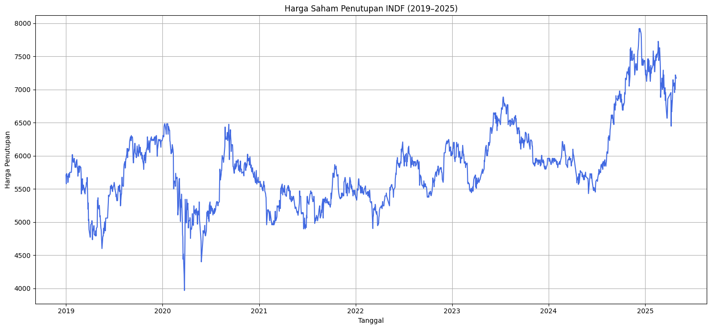
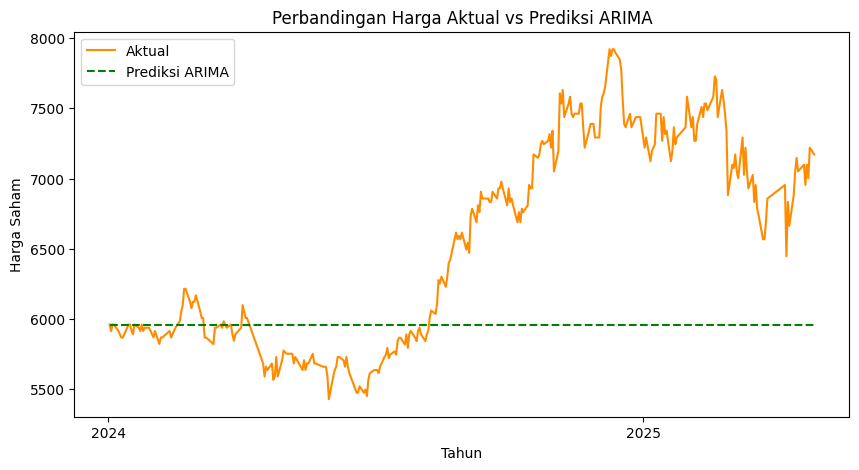

# 📈 Stock Price Forecasting: ARIMA vs Prophet (PT Indofood Sukses Makmur)
## 📌 Project Overview
This project compares **the forecasting performance of ARIMA and Prophet** models in predicting the stock price of **PT Indofood Sukses Makmur Tbk (INDF)** using historical time-series data. The study evaluates model accuracy using quantitative error metrics to determine which approach is more reliable for short-term stock price forecasting.

## 🎯 Objectives
- Analyze historical stock price trends of PT Indofood Sukses Makmur
- Build and compare ARIMA and Prophet forecasting models
- Evaluate model performance using MAPE and MAE
- Identify the model with superior predictive accuracy

## 📊 Dataset
- Source: Yahoo Finance
- Stock Code: INDF.JK
- Data Type: Daily closing price
- Period: Januari 2019 – April 2024
- Observations: Daily time-series records

## ⚙️ Methodology
1. Exploratory Data Analysis (EDA)
   - Trend and volatility analysis
   - Stationarity assessment
2. ARIMA Modeling
   - Differencing for stationarity
   - ACF & PACF analysis
   - Parameter selection and model fitting
3. Prophet Modeling
   - Trend decomposition
   - Automatic seasonality detection
   - Model training and forecasting
4. Model Evaluation
   - Mean Absolute Error (MAE)
   - Mean Absolute Percentage Error (MAPE)

## 🛠 Tech Stack
- Python
- pandas, numpy
- matplotlib
- statsmodels
- scikit-learn

## 🔍 Key Quantitative Insights
- Prophet consistently outperforms ARIMA across all evaluation metrics in forecasting INDF stock prices.
- Prophet achieves a lower RMSE (499.76) compared to ARIMA (907.49), reducing large prediction errors by ~45%.
- Mean Absolute Error (MAE) is significantly lower for Prophet (424.41) than ARIMA (701.36), indicating closer predictions to actual prices.
- MAPE improves from 9.98% (ARIMA) to 6.46% (Prophet), confirming higher relative accuracy in percentage terms.
- Results indicate Prophet is better suited for non-stationary and trend-driven financial time series than traditional ARIMA models.

## 📊 Model Performance Comparison (ARIMA vs Prophet)
| Model             | Parameters                     | RMSE   | MAE    | MAPE (%) |
| ----------------- | ------------------------------ | ------ | ------ | -------- |
| **ARIMA (1,1,0)** | p, d, q = (1, 1, 0)            | 907.49 | 701.36 | 9.98     |
| **Prophet**       | changepoint_prior_scale = 0.01 | 499.76 | 424.41 | 6.46     |

## 📊 Forecasting Results

